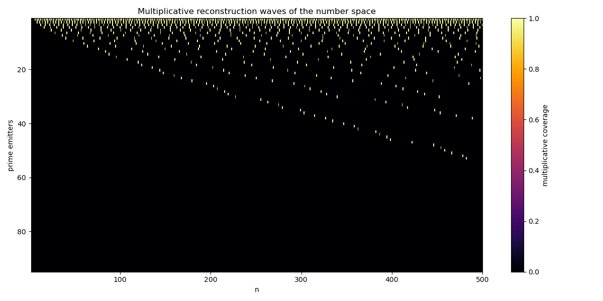

# primes4everybody (p4e)
### A constructive model of the number space — Prime numbers as *growth positions*, not anomalies

**primes4everybody (p4e)** implements a fully transparent and minimal demonstration of a new perspective on prime numbers:

> The number space is not a static infinite object.
> It grows additively — and is reconstructed multiplicatively.
> Prime numbers are the positions where multiplicative reconstruction cannot keep pace with additive growth.

This repository allows anyone to **reproduce, visualize, verify or falsify** the theory — without needing advanced mathematics.

---

## What this project demonstrates

| Classical mathematics | p4e perspective |
|----------------------|-----------------|
| Numbers exist all at once | Numbers appear step by step |
| Multiplication is neutral | Multiplication imposes interference patterns |
| Primes are anomalies | Primes are structural growth-gaps |
| π(n) looks mysterious | π(n) follows from deterministic growth energetics |

The core mechanism:

> Additive growth is complete and gap-free.  
> Multiplicative reconstruction is incomplete and generates interference.  
> The **gaps of this interference correspond exactly to prime numbers**.

This removes the conceptual mystery around primes *without* using sieving, factorization, modular arithmetic or probability.

---

## Key idea in one line
> Primes appear exactly at the positions where multiplicative coverage fails to occupy the next additive step.

---

## Visual structure of the prime distribution

The following plot is the core visual result of the model.

Each row represents a prime **emitter** (multiplicative coverage),
each column represents the **additive growth** of the number space.
Black gaps between the coverage waves are exactly the positions of the prime numbers.



This picture is important because it shows **the cause of primes, not only their statistical effects**.
It makes the growth mechanism *visible*, *reproducible* and *falsifiable*.

---

## Why primes become rarer
Growth density increases.  
Multiplicative coverage increases.  
Remaining gaps become narrower — but never disappear.

This is why π(n) slows down — *not* because primes “run out”, but because reconstruction pressure increases.

---

## Structure of this repository

/  
├── p4e.py  
├── visualize.py  
├── requirements.txt  
├── README.md  
│
├── docs/  
│   └── primes4everybody-DE.pdf
│   └── primes4everybody-EN.pdf  
│   └── multiplicative_reconstruction_waves.png
│
└── theory/  
    └── The_Irreducible_Structure_of_the_Prime_Distribution.pdf

Everything needed to **verify or refute the theory** is contained locally — no external references required.

---

Implementation is intentionally minimal

This version of the algorithm is written for clarity, not performance.

It shows the core mechanism of additive growth and multiplicative reconstruction as transparently as possible — without optimizations that would hide the structure.

Counter-intuitively, the constructive model becomes increasingly efficient at very large scales, because multiplicative coverage dominates and fewer numbers remain to be inspected individually.

Anyone is warmly invited to:
	•	optimize the implementation
	•	experiment with alternative data structures
	•	parallelize the reconstruction logic
	•	extend the visualization

Any improvement that preserves mathematical transparency is welcome.
Pull requests that explore new ideas are appreciated.

⸻

Scientific falsifiability

The model is incorrect if any of the following occur:

Failure	Meaning
- A composite is marked prime -> Model is wrong
- A prime is missed	Model -> is wrong
- Growth diverges from π(n) at scale -> Model is incomplete
- No Riemann-oscillation behaviour appears -> Model is incomplete

The project is valuable only because it can be disproven.

⸻

Research paper

Full, formal version:

The Irreducible Structure of the Prime Distribution
https://zenodo.org/records/17649211

License for the theoretical paper: CC BY-NC-ND 4.0

Available both online and in this repository at:
/theory/The_Irreducible_Structure_of_the_Prime_Distribution.pdf

⸻

Why this matters

This is not:
	•	a faster sieve
	•	a new primality test
	•	a cryptographic trick
	•	a probabilistic guess

It is a constructive explanation of why primes exist and how they are distributed — not as anomalies, but as structural consequences of growth.

This is the point of the project name:
not primes for mathematicians
not primes for experts
primes for everybody

⸻

Contact & contributions

Discussions and critique are welcome — especially mathematical critique.

To contribute:
	•	open an Issue,
	•	start a Discussion,
	•	or submit a Pull Request.

⸻

⭐ If this repository helped you
	•	leave a ⭐ (improves discoverability)
	•	cite the Zenodo DOI if used in research
	•	fork if you build on the idea

Open science moves faster when shared.

⸻

License

MIT — maximum openness for research and education.

---

## How to run

```bash
pip install -r requirements.txt
python p4e.py

Output:
	•	full number growth
	•	multiplicative coverage waves
	•	prime detection — without sieving and without division

⸻

Visualization (optional)

python visualize.py

Produces plots for:
	•	growth density vs. interference
	•	prime gap damping
	•	Riemann-like oscillations from the growth model
