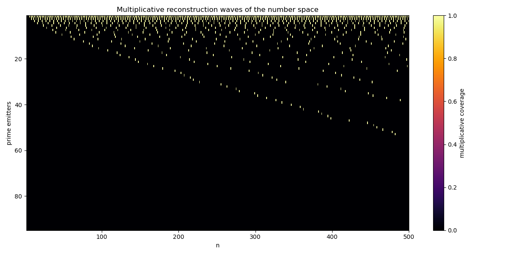

# primes4everybody (p4e)
### A constructive model of the number space — Prime numbers as *growth positions*, not anomalies

**primes4everybody (p4e)** implements a fully transparent and reproducible model of the prime distribution:

> The number space is not a static infinite object.  
> It grows additively — and is reconstructed multiplicatively.  
> Prime numbers are the positions where multiplicative reconstruction cannot keep pace with additive growth.

This repository allows anyone to **reproduce, verify or falsify** the theory — without needing advanced mathematics.

---

## What this project demonstrates

| Classical mathematics | p4e perspective |
|----------------------|-----------------|
| Numbers exist all at once | Numbers appear step by step |
| Multiplication is neutral | Multiplication imposes interference patterns |
| Primes are anomalies | Primes are structural growth-gaps |
| π(n) looks mysterious | π(n) follows from deterministic growth energetics |

The core mechanism:

> Additive growth is complete and gap-free.  
> Multiplicative reconstruction is incomplete and generates interference.  
> The **gaps of this interference correspond exactly to prime numbers**.

This removes the conceptual mystery around primes *without* using sieving, factorization, modular arithmetic, or probability.

---

## Key idea in one line
> Primes appear exactly at the positions where multiplicative coverage fails to occupy the next additive step.

Unlike classical approaches, primality is not determined by performing any computation *on* x.  
Whether x is prime is already decided by the global multiplicative state *before* x is reached.

---

## Visual structure of the prime distribution

Each row represents a prime **emitter** (multiplicative coverage).  
Each column represents the **additive growth** of the number space.  
Black gaps between coverage waves correspond exactly to the primes.



---

## Why primes become rarer

Growth density increases.  
Multiplicative coverage increases.  
Remaining gaps become narrower — but never disappear.

This explains why π(n) slows down:  
not because primes "run out", but because **reconstruction pressure rises**.

---

# Two complementary implementations

The repository contains **two implementations**, serving different purposes.

---

## 1. Minimal Python implementation (p4e.py)

This version is **intentionally minimal**.

It implements the constructive mechanism in the simplest possible form:

- additive growth  
- multiplicative reconstruction using local emitters  
- emergence of primes when coverage fails  

Its purpose is:

- teaching  
- visualization  
- transparency  
- falsifiability  
- step-by-step understanding  

It is *not* optimized for performance — by design.

---

## 2. Advanced Go implementation  
### MCG - Multiplicative Coverage Generator  

The MCG is a **full structural generator** of the theory:

- unbounded prime generation  
- segmented number space  
- deterministic global multiplicative coverage state  
- no sieving, no modulus, no trial division  
- high performance despite zero divisibility checks  
- faithful expression of the mathematical architecture  

### Key properties

- **Unbounded:**  
  Generates primes indefinitely without restarting.

- **Segmented growth:**  
  Processes the number space in fixed-size segments  
  (default: 1,000,000 integers per segment).

- **Generative dynamics:**  
  Each new segment is determined by the multiplicative waves  
  of all previously discovered primes.

- **Fast:**  
  On a standard machine, the MCG produces  
  **10,000 primes in under one second**  
  — without performing a single divisibility test.

- **Scientifically reproducible:**  
  The algorithm is a direct operationalization of the theory  
  from the accompanying research paper.

### Run the MCG

```bash
go run Multiplicative-Coverage-Generator.go
```

This prints the first 10,000 primes using the unbounded constructive generator.

---

# Repository structure

(See README for tree)

---

# Scientific falsifiability

The model is incorrect if any of the following occur:

| Failure | Meaning |
|---------|---------|
| A composite is marked prime | Model is wrong |
| A prime is missed | Model is wrong |
| Growth diverges significantly from π(n) | Model is incomplete |
| No Riemann-oscillation behaviour appears | Model is incomplete |

The project is valuable only because it can be disproven.

---

# Research paper

**The Irreducible Structure of the Prime Distribution**  
Zenodo: https://zenodo.org/records/17649211  
License: CC BY-NC-ND 4.0

---

# Why this matters

This is not:

- a new sieve  
- a primality test  
- a cryptographic trick  
- a probabilistic guess  

It is a **constructive explanation** of why primes exist and  
how they are distributed — not as anomalies, but as natural consequences of growth.

**Primes for everybody.**

---

# License

**MIT License** — maximum openness for research and education.
